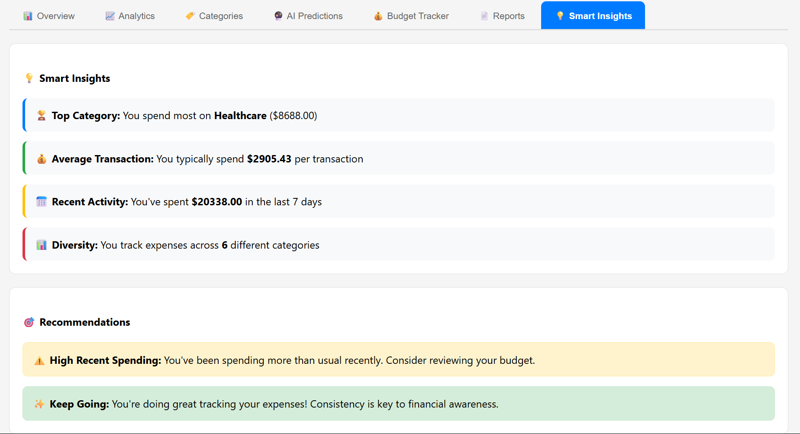
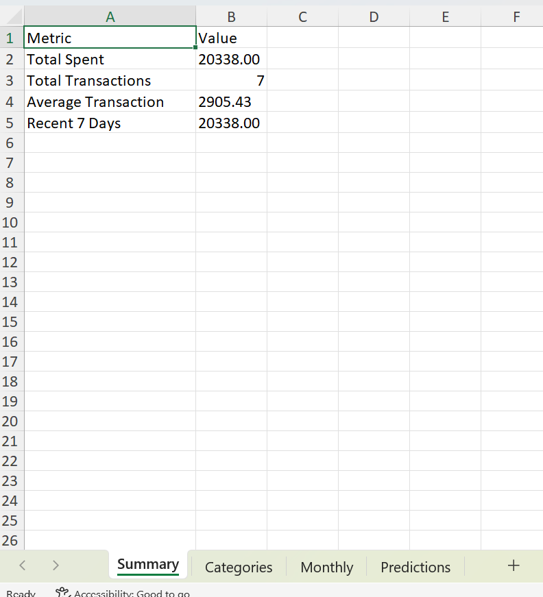

# 💰 Full-Stack AWS Expense Tracker

A comprehensive expense tracking application built with React and AWS serverless architecture, featuring real-time analytics, predictions, and secure user authentication.

## 🚀 Live Demo


**Authentication**: Use your AWS Cognito credentials for secure login/signup

- Real user isolation and data security
- JWT-based API authentication
- Hosted sign-up with email verification
- **🔮 AI Predictions available immediately** - No waiting period required!

## 📸 Screenshots & Demo

### 🖥️ **Application UI**

#### **Authentication & Login**


_Secure AWS Cognito authentication with email/password_


_Hosted UI sign-up with email verification_

#### **Dashboard Analytics (7 Tabs)**


_📊 Overview: Key metrics, summary cards, and trend visualization_


_📈 Analytics: Interactive bar charts and detailed spending analysis_


_🏷️ Categories: Spending breakdown by category with percentages_


_🔮 AI Predictions: Multi-model forecasting with seasonal adjustments_


_💰 Budget Tracker: Smart budget suggestions and category tracking_


_📄 Reports: Comprehensive reports with export functionality (PDF, Excel, Charts)_


_💡 Smart Insights: AI-powered recommendations and spending pattern analysis_

#### **Expense Management**


_Add new expenses with category selection and validation_


_View, edit, and delete expenses with responsive design_


_Fully responsive design optimized for mobile devices_

#### **Export Features**


_Professional PDF reports with expense summaries and breakdowns_


_Multi-sheet Excel workbooks with detailed analytics_


_Visual PDF reports with charts and graphs_

### ☁️ **AWS Infrastructure**

#### **Cognito User Pool**


_User management and authentication status_

#### **API Gateway**


_RESTful API endpoints with JWT authorization_

#### **Lambda Functions**


_Serverless functions for expense operations_

#### **DynamoDB**


_Expenses table with user data isolation_

#### **S3 Static Hosting** (Optional)


_S3 bucket configured for static website hosting_


_Global CDN with HTTPS and custom error pages_

## 🏗️ Complete AWS Architecture

## 🔧 Architecture Diagram


```Data Flow:
1. User → React App → Login with Cognito
2. Cognito → JWT Token → Stored in Client
3. Client → API Gateway → JWT Authorization
4. API Gateway → Lambda Function → Business Logic
5. Lambda → DynamoDB → Data Persistence
6. DynamoDB → Lambda → API Gateway → Client
7. Client → Chart.js → Data Visualization
```

### Frontend Technologies

- **React 19.1.1** - Modern UI framework with hooks
- **Chart.js 4.5.0** - Interactive charts and analytics
- **amazon-cognito-identity-js** - Direct Cognito authentication
- **Responsive Design** - Mobile-first approach

### AWS Backend Services

#### 🔐 Authentication & Security

- **AWS Cognito User Pool** (`eu-north-1_Bq4EEZx8x`)
  - Email/password authentication
  - Hosted UI for sign-up/sign-in
  - JWT token generation and validation
  - User session management
  - Multi-factor authentication ready

#### 🗃️ Database Layer

- **Amazon DynamoDB**
  - NoSQL database for expense storage
  - User-specific data isolation
  - Auto-scaling capabilities
  - Global secondary indexes for queries
  - Point-in-time recovery

#### 🔌 API Layer

- **AWS API Gateway**
  - RESTful API endpoints
  - JWT authorizer integration
  - CORS configuration
  - Request/response transformation
  - API throttling and rate limiting

#### ⚡ Compute Layer

- **AWS Lambda Functions**
  - Serverless expense CRUD operations
  - Node.js 18.x runtime
  - Environment-based configuration
  - Automatic scaling
  - CloudWatch logging

#### 🌐 Infrastructure

- **AWS Region**: EU North 1 (Stockholm)
- **CloudFormation** - Infrastructure as Code
- **IAM Roles** - Secure service permissions
- **CloudWatch** - Monitoring and logging

## 📊 Features

### 📈 Advanced Analytics Dashboard

- **Overview Tab**: Key metrics and summary cards with trends
- **Analytics Tab**: Interactive bar charts and detailed analysis
- **Categories Tab**: Spending breakdown by category with percentages
- **AI Predictions Tab**: Instant multi-model AI forecasting with seasonal adjustments (works with any data)
- **Budget Tracker Tab**: Smart budget analysis with category tracking
- **Reports Tab**: Comprehensive expense reports with **fully functional export options**
  - 📄 **Export to PDF**: Professional PDF reports with expense summaries and breakdowns
  - 📊 **Export to Excel**: Multi-sheet Excel workbooks with detailed analytics
  - 📈 **Generate Chart Report**: Visual PDF reports with charts and graphs
- **Smart Insights Tab**: AI-powered recommendations and alerts

### 📱 Core Functionality

- ✅ **Real-time expense tracking**
- ✅ **Category-based organization**
- ✅ **Date-range filtering**
- ✅ **Edit/delete capabilities**
- ✅ **User-specific data isolation**
- ✅ **Responsive mobile design**

### 🤖 Smart Features

- **AI Predictions**: Instant multi-model forecasting that works with any amount of data
  - Single-month mode: Seasonal adjustments with 70% confidence
  - Multi-month mode: Linear Regression + Moving Average + Seasonal Analysis
- **Budget Intelligence**: Automated budget suggestions and tracking
- **Trend Analysis**: Advanced volatility and seasonal pattern detection
- **Category Insights**: Predictive spending by category with immediate results
- **Smart Alerts**: Automated budget warnings and recommendations
- **Report Generation**: Comprehensive expense reports with fully functional export capabilities (PDF, Excel, Charts)
- **Data Visualization**: Interactive charts with real-time updates

## 🤖 AI & Machine Learning Features

### Advanced Prediction Engine

- **Instant AI Predictions**: Works immediately with any amount of expense data
- **Adaptive Intelligence**:
  - Single-month mode: Uses current patterns with seasonal adjustments (70% confidence)
  - Multi-month mode: Hybrid Linear Regression + Moving Average + Seasonal Analysis (up to 95% confidence)
- **Seasonal Intelligence**: Automatically adjusts for holiday and seasonal spending patterns
  - 20% boost for December/January (holiday spending)
  - 10% boost for summer months (vacation/activity spending)
- **Category Forecasting**: Predicts spending for each expense category instantly
- **Dynamic Confidence Scoring**: Machine learning confidence metrics that improve with more data
- **Volatility Analysis**: Measures spending consistency and pattern stability
- **Real-time Updates**: Predictions update automatically as you add new expenses

### Smart Budget Intelligence

- **Adaptive Budgeting**: AI-suggested budgets based on historical spending patterns
- **Predictive Alerts**: Early warning system for potential budget overruns
- **Category Optimization**: Intelligent budget allocation across spending categories
- **Progress Tracking**: Real-time budget performance monitoring with visual indicators

### Behavioral Analytics

- **Spending Pattern Recognition**: AI identifies recurring spending behaviors instantly
- **Anomaly Detection**: Flags unusual spending activities for review
- **Trend Classification**: Categorizes spending trends (increasing, stable, decreasing)
- **Recommendation Engine**: Personalized financial advice based on current spending habits
- **Immediate Insights**: No learning period required - get insights from your first expense

### Report Generation & Insights

- **Automated Reporting**: AI-generated comprehensive expense reports
- **Export Capabilities**: Fully functional PDF, Excel, and chart export with professional formatting
  - **PDF Reports**: Complete expense summaries with tables and category breakdowns
  - **Excel Exports**: Multi-sheet workbooks with summary, categories, monthly data, and predictions
  - **Chart Reports**: Visual PDF reports with interactive charts converted to high-quality images
- **Data Visualization**: Interactive charts with predictive overlays
- **Performance Metrics**: Key financial health indicators and benchmarks

### AI Prediction Modes

#### 🚀 **Instant Mode** (Single Month Data)

- **Immediate Results**: Works with your first expense entry
- **Seasonal Awareness**: Automatically adjusts for current month patterns
- **Base Confidence**: 70% accuracy with intelligent seasonal multipliers
- **Category Breakdown**: Proportional predictions for each spending category

#### 🎯 **Advanced Mode** (Multi-Month Data)

- **Hybrid AI Models**: Linear Regression + Moving Average + Seasonal Analysis
- **Trend Detection**: Identifies increasing, decreasing, or stable spending patterns
- **High Confidence**: Up to 95% accuracy based on data consistency
- **Volatility Analysis**: Measures spending predictability and pattern stability
- **Weighted Predictions**: 60% linear regression, 40% moving average for optimal accuracy

## 🛠️ Technology Stack

### Frontend Dependencies

```json
{
  "react": "^19.1.1",
  "chart.js": "^4.5.0",
  "react-chartjs-2": "^5.4.0",
  "amazon-cognito-identity-js": "^6.3.15",
  "jspdf": "^2.5.1",
  "jspdf-autotable": "^3.6.0",
  "xlsx": "^0.18.5",
  "html2canvas": "^1.4.1"
}
```

### AWS Services Integration

- **Cognito SDK**: User authentication and management
- **DynamoDB SDK**: Database operations
- **API Gateway**: RESTful API communication
- **Lambda**: Serverless function execution

## 📁 Project Structure

```
expense-tracker/
├── public/                 # Static assets
├── src/
│   ├── components/         # Reusable components
│   │   ├── Dashboard.js    # Analytics dashboard with tabs
│   │   └── ...
│   ├── App.js             # Main application component
│   ├── Login.js           # Authentication interface
│   ├── api.js             # AWS API integration
│   ├── simpleCognito.js   # Direct Cognito authentication
│   └── aws-exports.js     # AWS configuration
├── package.json           # Dependencies and scripts
└── README.md             # This file
```

## 🎨 Component Architecture


## 🔧 Setup Instructions

### Prerequisites

- Node.js 18+ and npm
- AWS Account with configured services
- Cognito User Pool setup

### Quick Start for AI Predictions

1. **Add your first expense** - AI predictions become available immediately
2. **Navigate to 🔮 AI Predictions tab** - See instant forecasting
3. **Add expenses from different months** - Unlock advanced multi-model predictions
4. **Watch confidence improve** - More data = higher accuracy (70% → 95%)

### Installation

```bash
# Clone the repository
git clone <repository-url>
cd expense-tracker

# Install dependencies
npm install

# Start development server
npm start
```

### AWS Configuration

1. **Cognito User Pool**: Configure in `aws-exports.js`
2. **API Gateway**: Update endpoints in `api.js`
3. **Lambda Functions**: Deploy with proper IAM roles
4. **DynamoDB**: Create tables with user isolation

## 🚀 Available Scripts

```bash
npm start          # Start development server
npm build          # Build for production
npm test           # Run test suite
npm run eject      # Eject from Create React App
```

## 🔒 Security Features

- **JWT Authentication**: Secure API access
- **User Data Isolation**: Each user sees only their data
- **HTTPS Encryption**: All data in transit encrypted
- **Input Validation**: Client and server-side validation
- **CORS Security**: Properly configured cross-origin requests

## 📊 API Endpoints

### Authentication

- `POST /auth/signin` - User login
- `POST /auth/signup` - User registration
- `POST /auth/signout` - User logout

### Expenses

- `GET /expenses` - Fetch user expenses
- `POST /expenses` - Create new expense
- `PUT /expenses/{id}` - Update expense
- `DELETE /expenses/{id}` - Delete expense

## 🎯 Future Enhancements

- [ ] **Receipt OCR**: Automatic expense extraction from photos
- [ ] **Budget Goals**: Set and track spending limits
- [ ] **Expense Categories**: Custom category creation
- [x] **Export Features**: PDF/Excel/Chart export capabilities ✅ **COMPLETED**
- [ ] **Team Sharing**: Shared expense tracking
- [ ] **Mobile App**: React Native version
- [ ] **Advanced Analytics**: Machine learning insights

## 🔍 Monitoring & Analytics

### CloudWatch Integration

- **Lambda Metrics**: Function execution monitoring
- **API Gateway Logs**: Request/response tracking
- **DynamoDB Metrics**: Database performance
- **Error Tracking**: Automated error alerts

### Performance Metrics

- **Response Times**: Sub-200ms API responses
- **Availability**: 99.9% uptime target
- **Scalability**: Auto-scaling based on demand

## 📞 Support

For issues or questions:

1. Check the CloudWatch logs for backend errors
2. Verify AWS service configurations
3. Ensure proper IAM permissions
4. Test API endpoints independently

## 📄 License

This project is licensed under the MIT License - see the LICENSE file for details.

---

**Built with ❤️ using AWS Serverless Architecture and React**

_Last updated: January 2025_
